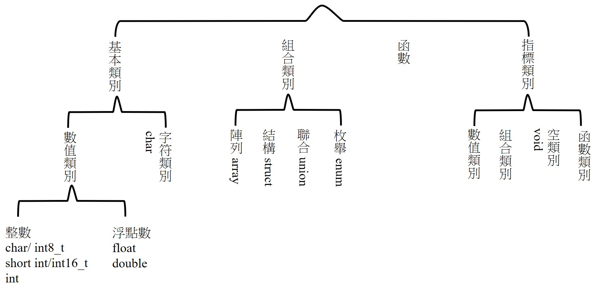
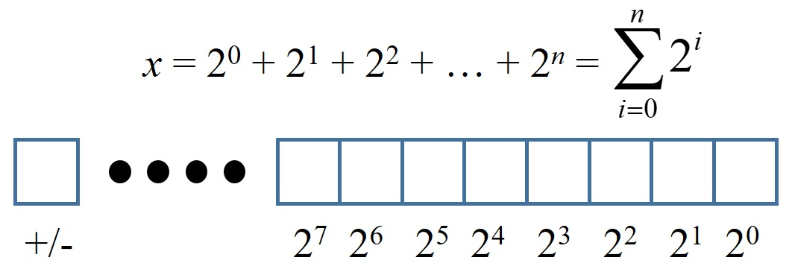

# 基本型別介紹
C 是較早就發展出來的語言，早期的記憶體容量沒有很大，故有內建許多型別供程式設計師，針對數值的類別及範圍選擇使用記憶體最小的使用，下列整理出 C 語言中的所有型別。


其中基本型別就是最小單位，組合類別與指標皆與基本型別有關。

| 型別 | 別名 | 範圍 | 大小(Byte) |
| --- | --- | ---: | ---: |
| 字元 int_8t | char | –2<sup>7</sup> ~ 2<sup>7</sup> – 1 | 1 |
| 短整數 int_16t | short int | –2<sup>15</sup> ~ 2<sup>15</sup> – 1 | 2 |
| 整數 int_32t | int | –2<sup>31</sup> ~ 2<sup>31</sup> – 1 | 4 |

| 型別 | 精度 | 範圍 | 大小(Byte) |
| --- | --- | ---: | ---: |
| 單精度浮點數 float | 7 位數 | 約–10<sup>–39</sup> ~ 10^<sup>38</sup> | 4 |
| 雙精度浮點數 double | 15 位數 | 約–10<sup>–309</sup> ~ 10^<sup>308</sup> | 8 |

註1：另外還有長整數、超長整數、長雙精度浮點數、超長雙精度浮點數，但不在圖表內。
註2：不同的標準與編譯器也許與上述不同，可使用 limit.h 確認
http://tw.gitbook.net/c_standard_library/limits_h.html

## 1. 整數
在電腦中皆是使用 0 與 1 (1 bit, 8 bits = 1 byte) 來表達，而數值上即為**二進位**，任意十進位的整數皆能使用二進位表示。在上述整數型別中，以 char 為例，其大小為 1 byte = 8 bits，最左邊的位元保留給符號使用，再往右依序為 2<sup>7</sup>, 2<sup>6</sup>, ..., 2<sup>0</sup>，故其範圍為 –2<sup>7</sup> ~ 2<sup>7</sup> – 1。若最前面的位元不保留給符號使用，也就是無號數，則範圍為 0~ 2<sup>8</sup> – 1，在 C 語言中，**所有整數型別預設為有號數**，若要使用無號數則使用 **unsigned** 此關鍵字。若是有號數與無號數一起做運算，則**都會轉型成有號數**。


註：2<sup>10</sup> ~ 10<sup>3</sup>，可使用此關係來估算。

## 2. 位移運算
位移運算僅能使用於整數型別的數值。由於電腦儲存數值的方式，可知該整數型別往右位移`>>`即為除二，最左邊自動補 0，反之`<<`為乘二，最右邊自動補 0。在使用位移運算時通常會使用無號豎，因為左移與右移時都會影響到最左邊的位數。

範例： a×8 --> a<<3 (a 連續乘 2 三次)，a×9 = a×(8+1) = a×8 + a --> a = a << 3 + a

## 3. 浮點數
在 IEEE 統一浮點數表示法前，有許多種浮點數表示法，現在統一為科學記號表示法，對於任意數 x = *fraction × 2^exponent* ~ *fraction × 10^exponent*。而浮點數最少為 32 bits，其中最左邊為正負號，接下來從左第二位到第九位為指數部分，剩下的 23 bits 為有效位數，轉成十進位後有效位數為 **7** 位。因為浮點數的表示法，**故電腦中的浮點數表示的整數跟整數不一定相同**。

https://en.wikipedia.org/wiki/Floating-point_arithmetic#Internal_representation

## 4. 宣告變數
由於數值型別有許多種，且每種所佔的記憶體與使用方式也不同，故我們在給變數時要一併把其型別給清楚才能讓電腦知道。在**宣告變數時不一定要給值**，可以在程式執行中在給值。但若沒有在宣告時給值，因為所占用的記憶體也不一定為 0，故可能還是有其他亂數。
```C
int i, j = 0;
float pi = 3.14159f;
double e = 2.718281828;
```
註：在 C 語言中若為浮點數，其預設為 double，必須在後面加上 `f` 才是 float。

## 5. 整數與浮點數混用
* 四則運算

在做計算或比較時免不了整數與浮點數一起計算，若是浮點數與整數一起在同一個算式中，或是僅有浮點數，則所有計算後的數值都會被預設為是浮點數。若是皆為整數，則計算後的數值也為整數。然而兩整數相除後的結果不一定為整數，根據前之邏輯，其數值會做無條件捨去 (floor)。**故若需要兩整數相除，建議都轉為浮點數**。

* 比較

由浮點數的儲存方式可知，用浮點數儲存整數在電腦中不一定是整數，例如 100.f 在電腦中可能為 99.999999 或 100.00001，故當在比較兩浮點數是否相等，或是整數與浮點數是否相等時，通常會設定差的絕對值小於多少後即為相等。例如兩浮點數 a, b，若 |a - b| < eplion，則 a = b。
