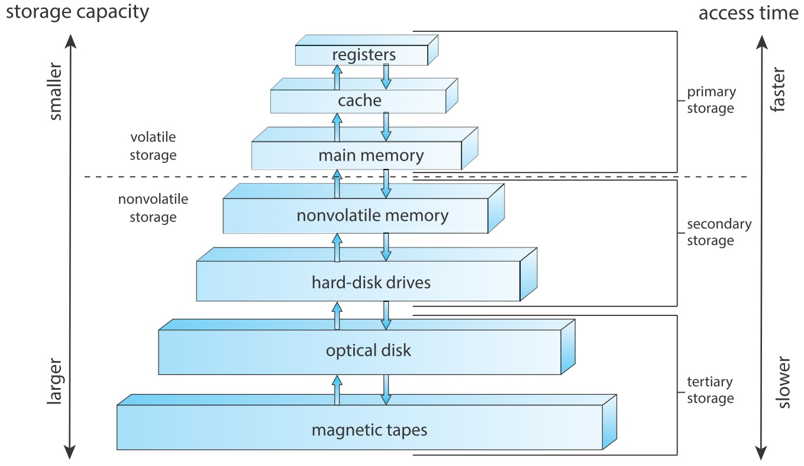

一般軟體的開發上比較是在較強的 PC 上做運算，所以較少使用或看到這三個關鍵字，但如果是在一些比較低階的裝置或是較接近硬體的程式，例如 MCU，此時就會常使用或看到這些關鍵字。

## 1. volatile
C 語言在程式完成後需要編譯成其他檔案才能執行，而編譯器在某些地方會幫忙做最佳化。不過有些時候雖然能在效率上做最佳化，但卻不能得到想要的結果。volatile 中文意思是「易揮發的」，在程式語言中的意義為「易變的」，也就是在程式執行過程中有一個變數會根據硬體的輸入而改變，但是編譯器覺得這種寫法沒效率，會直接把該變數設為定值，所以此關鍵字是告訴編譯器**不要對此變數做最佳化的意思** \
註：不同的程式語言中也有此關鍵字，但是用法大不相同，故在這邊所提到的僅為 C 的用法。
#### 1. 語法
若要宣告一變數或指標為 volatile 有以下四種：
```C
volatile int foo;  // 一個易變的整數變數
int volatile foo;  // 一個易變的整數變數

volatile int *foo; // 一個值易變的整數指標
int volatile *foo; // 一個值易變的整數指標

int * volatile foo;//一個位置易變的整數指標

int volatile * volatile foo;//一個值與位置易變的整數指標
```

#### 2. 編譯器優化
當程式碼寫完後編譯器會先做檢查，當編譯器發現此值只會與最後出現的敘述有關時，編譯器就會把前面的程式碼忽略，只接跳到最後一個跟他有關的敘述。
```C
int a = 1;
a = 2;
a = 3;
```
此時編譯器會值將讓 a = 3，但是這種寫法可能有其他用意，如下面例子所述。

#### 3. 在 I/O 的情況下使用
```C
int *output = (unsigned int *)0xff800000;  //定義一個IO埠；
void init(void)
{
    int i;
    for(i = 0; i < 10; i++) *output = i;
}
```
以上程式碼片段為等待儀器或使用者狀態改變用，但是編譯器覺得從上下文看不出什麼變化，所以會將以上程式碼優化如下
```C
int *output = (unsigned int *)0xff800000;  //定義一個IO埠；
void init(void)
{
    *output = 9;
}
```
所以可將 * output 用 volatile 修飾，如此一來就會跟著所接收到的資料改變。其餘範例可參考維基百科
```C
volatile int *output = (unsigned int *)0xff800000;  //定義一個IO埠；
void init(void)
{
    int i;
    for(i = 0; i < 10; i++) *output = i;
}
```
https://en.wikipedia.org/wiki/Volatile_(computer_programming)

#### 3. 與 const 合用
const 這個關鍵字可以讓變數的值不能由**程式碼**改變，但是此變數可能會隨著外部裝置給的訊號有所不同。所以當從外部讀取某個資料，且一定要放在某一段記憶體時，就會看到這種用法。
```C
unsigned int const volatile *status_reg;
```

#### 4. 與多執行緒的關係
volatile 這個關鍵字是在 C99 前就已經有的，然而與多執行緒 (multiple threading) 的關鍵字與 header 則是在 C11 才加入在多執行緒程式中。在多執行緒程式要避免死結 (Deadlock)[1] 的發生，這會讓 CPU 的使用效率大大降低，其中一個解法就是使用 mutex 上鎖。那麼在沒有用 C11 標準要如何避免呢？volatile 就是一個解法，詳情可參考以下文章 \
https://www.drdobbs.com/cpp/volatile-the-multithreaded-programmers-b/184403766 \
當然若是使用 C11/C++11，mutex 是更好的選擇。 \
[1] 死結 (Deadlock)：當有以下情況**同時**發生時就是產生了競爭條件
1. 禁止搶占（no preemption）：系統資源不能被強制從一個行程中登出。
2. 持有和等待（hold and wait）：一個行程可以在等待時持有系統資源。
3. 互斥（mutual exclusion）：資源只能同時分配給一個行程，無法多個行程共享。
4. 循環等待（circular waiting）：一系列行程互相持有其他行程所需要的資源。
https://zh.wikipedia.org/wiki/%E6%AD%BB%E9%94%81

## 2. register
雖然對於多數的程式設計者而言記憶體可以當作是一樣的，但是在硬體上其實存在著不同等級的記憶體。在電腦中越貴的記憶體跑越快，當然容量也越小，反之則越大，所以速度最快的記憶體通常最少，反之最多。若是牽涉到較接近底層硬體的程式就會使用到此關鍵字。 \
 \
source: CSAPP 
一般的變數如果沒特別宣告，大部分是存在 RAM 中，當使用此關鍵字修飾該變數時，該變數就會放在 CPU 的記憶體中。下方例子展示一的變數用 register 較沒用此關鍵字修飾的將近快 2 倍。
```C
#include <stdio.h>
#include <time.h>

int main()
{

    clock_t start, end;
    start = clock();
    
    register int a = 0;  // t = 0.002065 s
    //int a = 0;  // t = 0.003931 s
    for(int i = 0; i < 1000001; i++)
    {
        ++a;
        --a;
    }
    
    end = clock();
    double cpu_time_used = ((double) (end - start)) / CLOCKS_PER_SEC;
    printf("%f\n", cpu_time_used);
    
    return 0;
}
```

## 3. restrict
此關鍵字從 C99 以後才有，如果是使用較早的標準則無法使用，此關鍵字只能修飾**指標**。C 語言對於指標的保護不夠好，沒有辦法判定在同一段記憶體中，是否只有一個指標指向該位置，所以編譯器在這方面就不會做優化。
```C
int a = 0;
int *p1 = &a, *p2 = &a; //這是可以的，當改了其中一個，另外兩個也會跟著變
```
當使用這個關鍵字時，就是告訴編譯器可以直接做優化，跟 volatile 是相反的。
```C
int add(int *a, int *b)
{
    *a = 1;
    *b = 2;
    return *a + *b;
}
```
在上面範例中編譯器會用最安全的作法，也就是 * a 和 * b 是指向兩個不同的位置，所以在最後的 return 時還要再去找 a 的位置，因為 a 有可能被上一行修改。但是如果用 restrict 關鍵字修飾 a, b，那麼在意義上就是**程式設計者保證這兩個指標不會指向同一個位置，請編譯器直接優化**
```C
int add(int * restrict a, int * restrict b)
{
    *a = 1;
    *b = 2;
    return *a + *b;
}
```
所以在上述兩函數宣告中，引數有用 restrict 修飾的關鍵字所產生的組合語言會比較短，可參考以下網址 https://www.zhihu.com/question/41653775 \
