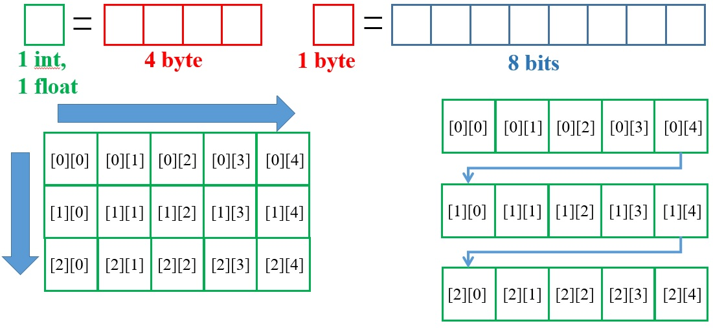
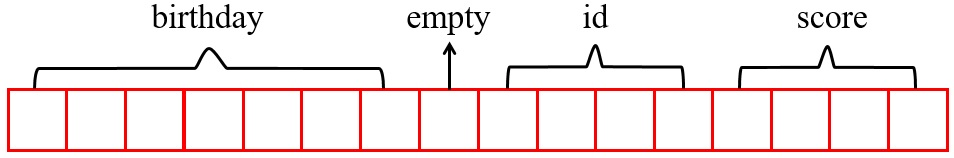
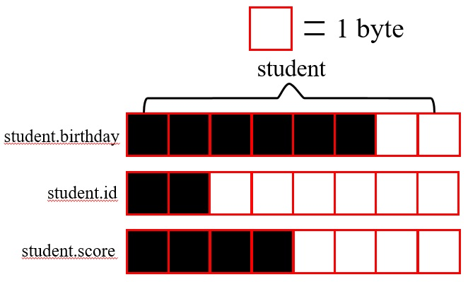

# 組合型別介紹
組合型別即為數值型別組合而成，在程式中善用組合型別能夠讓你的程式更方便且在使用上更有效率。

# 1. 陣列 array
* 介紹
陣列是由相同的基本類別所組成，在 C 中雖然有多維度陣列，但實際上在記憶體中皆為一為陣列，此僅為操作上如同數學陣列一樣而已，且記憶體位置為連續的。而陣列的取值可以直接選取陣列的第幾個元素，不須從頭或尾開始，故在取用上會非常快速。而多維陣列可看成一維陣列中還有一個一維陣列，當宣告一個 m×n 的陣列時，可看成有 m 個陣列，每個長度皆為 n。其中一維陣列可看作向量 (Vector)，二維陣列可看作矩陣 (Matrix)，多維陣列可看作張量 (Tensor)。


* 宣告與賦值
如同基本型別，其宣告須給定型別但不需一開始就給值。而陣列因有許多元素，故會使用 `大括號{ ... }` 將其包起來，在二維陣列中則會用 `{{ ... }}` 。
```
float y[5];
int a[10] = {0};  //將所有元素設為 0
int b[] = {0, 1, 2, 3};  //元素由 0~3 依序為 0, 1, 2, 3，其長度為 4
int c[4][4] = {{0, 1, 2, 3}, {4, 5, 6, 7}, {8, 9, 10, 11}, {12, 13, 14, 15}};  //多維陣列宣告與賦值
```
* 在多維陣列中，如同數學陣列一樣，最左上方的元素 c_00 = c[0][0] 為第零列，第零行元素，且先由左至右，再由上而下。故 c_23 = c[2][3] 為第二列，第三行的元素。然而雖然記憶體位置是連續的，但是對於相同大小的陣列，一維的取用又比多維的取用更快速。例如 c[4][4] 可以改宣告一 c[16] 的陣列，取用 c[2][2] 可寫成 c[2×4+2]。給定 c[m][n]，若要取用 c[i][j] (0 ≤ i < m, 0 ≤ j < n, i, j ∈ **Z**) 可寫成 c[i×n+j]。

# 2. 結構 struct
* 介紹
結構與與陣列最大的不同在於，結構可存放不同類別的資料。不同的資料型別除了能省下空間外，也能夠讓我們的資料結構更加彈性，在資料封裝上也能讓程式碼可讀性更高。也因為可存放不同類別的資料，記憶體雖然也是連續，但因為電腦處理 2^m (m ∈ **Z**) 的數字較快，故編譯器(compiler)會做`記憶體對齊(memory-alignment)`，會造成空間的浪費，當然也可以使用 -o3 來讓記憶體連續，但是速度就會較慢 (與對齊相比)。


* 定義新的資料類別
因為結構內有多種不同類別的資料，故我們需要用 `struct` 這關鍵字來宣告，且結構內不同的資料型別以`;分號`隔開，並先定義此資料類別的名稱與內容物，內容物我們稱為成員(member)。
```
struct student
{
    char birthday[7];
    int id;
    float score;
};
```
此結構內的成員共佔了 7+4+4 = 15 bytes 的記憶體，但因記憶體對齊的緣故，總共佔了 16 bytes 的記憶體。

* 宣告與賦值
struct student 為一種新定義的資料類別，裡面包含了一個字串陣列，名稱是 birthday，整數變數，名稱是 id，浮點數變數，名稱是 score。接著我們就可以宣告新的類別變數
```
struct student peter;
```
也可以在定義完後直接宣告
```
struct student
{
    char birthday[7];
    int id;
    float score;
}peter;
```
上面這段宣告了 peter 這個變數，類別為 struct competitor。而結構內變數賦值可以在一開始宣告時就直接給，也可以宣告完後再給。在宣告時各成員用分號分開，但是賦值時以`,逗號`分開，其賦值方式有以下幾種：
1. 照順序給值
```
struct student peter = {“890229", 10039, 88.88};
```
2. 照成員名稱給值(不須照順序)
```
struct student peter = 
{
    .id = 10039,
    .birthday = “890229",
    .score = 88.88,
};
```
3. 一個一個給值
```
struct student peter;
peter.id = 10039;
peter.score = 88.88;
peter.birthday[0] = ‘8’;
peter.birthday[1] = ‘9’;
.
.
.
peter.birthday[5] = ‘9’;
peter.birthday[6] = ‘\0’;
```
* 巢狀結構
當定義了新的變數類別後，也能夠在結構內宣告一個結構，即為巢狀結構。
```
struct score {
    int rank;
    float point;
};

struct student {
    char birthday[7];
    int id;
    struct score math;
};
```
賦值方式如下：
```
struct competitor peter = {“890229", 10039, {3, 88.88}};
```
```
struct student peter = 
{
    .id = 10039,
    .birthday = “890229",
    .math.rank = 3,
    .math.point = 88.88,
};
```
```
struct student peter;
peter.id = 10039;
peter.point = 88.88;
peter.math.rank = 3;
peter.birthday[0] = ‘8’;
peter.birthday[1] = ‘9’;
.
.
.
peter.birthday[5] = ‘9’;
peter.birthday[6] = ‘\0’;
```
# 3. 聯合 Union
* 介紹
在早期記憶體容量僅有 KB 甚至 MB，故對於記憶體的使用很嚴格(僅能用 < 10 KB 的量)。即便到了現在仍有許多攜帶式儀器，如運動手環對於記憶體用量要求很嚴格，或是在傳封包時只能一次傳 1 byte，但是要傳浮點數出來，此時 Union 就是一個很好的選擇。然而 Union 不論是定義、宣告或成員賦值，基本上只要將 struct 關鍵字改為`union`，其餘都跟結構完全一樣。當定義好內部成員後，編譯器會找出佔最大記憶體的成員來當作此類別的記憶體使用量。也因為內部成員占用同一區段的記憶體，故`內部成員不能同時取用`。
```
union student
{
    char birthday[7];
    int id;
    float score;
}peter;
```
上述 union 中占最大記憶體的變數為`char birthday[7]`，但因為記憶體對齊的緣故，此類別佔了 8 bytes。


# 4. 列舉 enum
* 介紹
列舉是一種可以將文字直接轉成數字的資料結構，不論內部成員有幾個，所佔的記憶體量皆與 int 相同，也就是 4 bytes。若沒有特別給值，其內部成員由上而下分別為 0, 1, 2, ...，若有，則從有給值的數值後 +1。**沒有巢狀列舉**

* 宣告與賦值
其宣告方式與 struct 類似，但是內部成員不需要給型別，且成員名稱在同一個`可視範圍內不能重複`，故通常會以全域變數宣告。
```
enum id {
    Mary,
    Peter,
    Lucas,
};
```
在上述例子中，定義了一個列舉型別，其成員有 Mary (= 0), Peter (= 1), Lucas (= 2)。
```
enum id {
    Mary = 11,
    Peter,
    Lucas,
};
```
在上述例子中，定義了一個列舉型別，其成員有 Mary (= 11), Peter (= 12), Lucas (= 13)。
