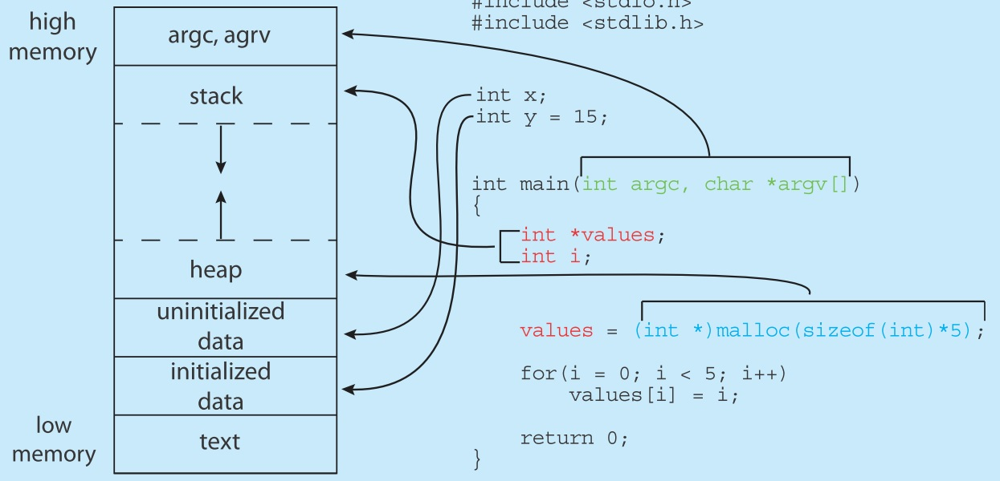

在任何程式語言中，若有一段程式碼會常常使用，我們會將其另外抽出來，並在需要的地方呼叫他，抽出來的部分即為函數。函數的結構如下
```
回傳值型別 函數名稱(引數1, 引數2, ...)
{
    ...
    return 變數;
}
```
## 1. 傳入與回傳基本型別
例如在程式中常常需要兩個數相加，就會實作一個兩數相加的函數
```C
int add(int a, int b)
{
    return (a+b);
}
```
但是 C 語言對於傳入與回傳的型別較嚴格，所以同一個功能的數學函數通常要另外寫整數相加與浮點數相加，並給予不同的函數名稱。
```C
float fadd(float a, float b)
{
    return (a+b);
}
```
且傳入的型別要與其規定的相同，否則會有精度問題，傳入的個數雖然不一定要相同，但是在 C 語言中多數函數的傳入個數要與規定的相同，否則編譯器會報錯。
```C
float pi = 3.14f, e = 2.7182f, result;
result = add(pi, e) //傳入時就會失去精度，如果再作除法也會在失去一次精度
```
## 2. 傳入與回傳組合型別
除了傳入與回傳基本型別，也可以傳入與回傳組合型別，以結構為例：
```C
struct student
{
    char birthday[7];
    int id;
    float score;
}peter;

struct student assign(struct student name)
{
    name.birthday = "811111";
    name.id = 15;
    name.score = 84.7f;
    return name;
}

struct student peter;
peter = assign(peter);
```
上述函數傳入一個結構，並回傳一個結構。

## 3. 回傳 void 及引數 void
有時函數可能會不想要有回傳值，此時可以在函數型別宣告 void，即告訴程式此函數沒有回傳值，在函數的最後也不需要 return。
```C
void pass(int a)
{
    printf("%d\n", a);
}
```
若是函數完全不需要傳入引數，則在引數的部分輸入 void，若是留下空白則表示不限定引數個數。
```C
void pass1(void)
{
    printf("%d\n", a);
}

void pass2()
{
    printf("%d\n", a);
}
int n = 19
pass1(n);  //編譯器會報錯
pass2(n);  //編譯器不會報錯且可正常執行，會印出 10
```
## 4. main 函數
main 函數算是一個比較特別的函數，這個函數告訴程式主體從這裡開始執行，在其他語言中雖然有不同的形式，但是名稱都是 main。而在 C 語言中 main 函式的原型雖然網路上有好幾種，但是在 C 的標準規格書中明定只有兩種
```
5.1.2.2.1 Program startup
1 The function called at program startup is named main. The implementation declares no prototype for this function. 
It shall be defined with a return type of int and with no parameters:
int main(void) { /* ... */ }
or with two parameters (referred to here as argc and argv, though any names may be used, 
as they are local to the function in which they are declared):
int main(int argc, char *argv[]) { /* ... */ }
or equivalent;9) or in some other implementation-defined manner.
```
其中 int main(void) 可直接在 IDE 上執行，int main(int argc, char * argv[])則是在命令列上使用，例如
```C
int main(int argc, char *argv[]) {
    printf("We have %d arguments:\n", argc);
    for (int i = 0; i < argc; ++i) 
    {
        printf("[%d] %s\n", i, argv[i]);
    }
    return 0;
}
```
當在命令列上輸入 ./a.out JRphy 後會得到
```
"We have 2 arguments:"
[0] ./a.out
[1] JRphy
```
而回傳是整數型別可以讓你判斷程式是否成功執行，一般程式中回傳為 0 表示成功執行，其他整數則會有其他意義。

一般初學者在寫程式時通常會把所有要用的東西都放在 main 函式中，雖然程式可以正常運作，但是可讀性非常差且會讓程式碼非常冗長，故會將重複使用到的部分提出 
main 以外，需要呼叫時就可以重複使用。

## 4. 程式中函數的位置
在 C 語言中將函式提到 main 外面的寫法有以下兩種。假設我們要寫一函數找出一陣列中的最大值，因為程式碼是從上面往下走，我們可以將所要使用到的函數寫在 
main 函數之前
```C
#include<stdio.h>
int max(int a, int b)
{
    if(a >= b) return a;
    else return b;
}
 
int main()
{
    int array[] = {6, 4, 9, -1, 5, 8, 11, -3};
    int value = -9999, i;
    for(i = 0; i < 8; i++) value = max(value, array[i]);
    printf("%d\n", value);
    return 0;
}
```
也可將函數原型先宣告於 main 之前，在將函數的詳細內容寫在 main 之後。此時當 main 函式中呼叫到你所宣告的函數名稱時，就會去往下找他的實做方式
```C
#include<stdio.h>
int max(int a, int b);  //此為函數的宣告

int main()
{
    int array[] = {6, 4, 9, -1, 5, 8, 11, -3};
    int value = -9999, i;
    for(i = 0; i < 8; i++)
    value = max(value, array[i]);
    printf("%d\n", value);
    return 0;
}

int max(int a, int b  //此為函數的定義或實作
{
    if(a >= b) return a;
    else return b;
}
```
在多人開發或大型程式開發實，會建議先將函數原型宣告出來，並在 main 函數後實作，因為有可能函數 A 需要呼叫到函數 B，但是 B 函數的實作在 A 之前，
若是用第一種方式則會報錯，而且也不清楚這一支程式中有那些函式。因此若是將函式的原型先宣告在 main 之前除了無關順序外，也可以讓讀者容易了解這隻
程式使用到了哪些函數及其原型。

## 5. 傳值入函數的行為
函數若要傳值的話需要有引數，如果想要在函數內交換兩個變數的值，通常初學者會寫以下函數
```C
#include<stdio.h>
int swap(int a, int b);

int main()
{
    int a = 5, b = 10;
    swap(a, b);
    printf("%d\t%d\n", a, b);
    return 0;
}

int swap(int a, int b)
{
    int temp = a;
    a = b;
    b = temp;
}
```
但是結果不如預期把兩變數數值交換，原因是這種行為在程式裡面會先將 a, b 的值複製一份出來，**傳入複製的那份進函數裡面**，所以雖然在函數內的寫法沒錯，但是實際上並沒有真的將值交換。\
在 C 語言規格書中只有 call by value，不論是傳值、指標、指標的指標......，都是把該數值或位置複製一再**傳入複製的那一份**。

## 6. 遞迴函數與記憶體
在實體記憶體有分等級 (執行速度，價錢)，而在作業系統中會將記憶體分區段，不同的系統會有不同的實作方式，主要差在 stack 與 heap，各個區段會儲存不同的東西，如下圖所示
 \
source: OPERATING SYSTEM CONCEPTS 10ed

不論是在傳入引數或是回傳值，都會先將欲傳入的值或是回傳值置於 stack 中，當整個函數呼叫結束後就會自動釋放。一般來說 stack 的大小通常很小，但可以通過編譯器來調整大小。所以若是遞迴函數傳得太深，就會造成 stack overflow。雖然遞迴函數在撰寫上可以寫得非常簡潔，但是在實際使用上卻非常危險。

函數除了先將回傳值傳出來外，也可以在函數裡面呼叫自己，此種函數稱為遞迴函數，此時函數的回傳值會先存在 stack memory 中，直到呼叫到最後一層才釋放。
```C
int Fibonacci(int n)
{
    if(n == 0) return 0;
    else if (n == 1) return 1;
    else return (Fibonacci(n-1) + Fibonacci(n-2));
}
```
在上述費式數列遞迴版的程式中，若呼叫 Fibonacci(5)，則在函數中會再呼叫 Fibonacci(4) 和 Fibonacci(3)，Fibonacci(4) 又會呼叫 Fibonacci(3) 和 Fibonacci(2)，直到呼叫到 Fibonacci(1) 或 Fibonacci(0) 才會停止，而這些回傳直都是先放在 stack 中，所以 n 過大就有可能出現 stack overflow。
