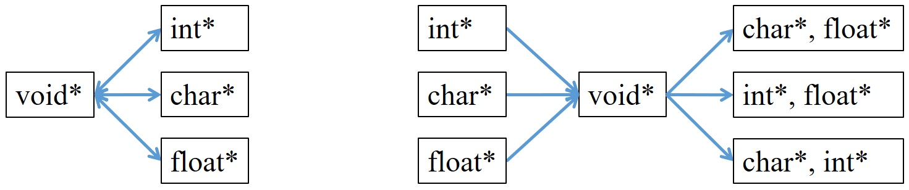

在程式中宣告變數後有以下三個性質：變數名稱、變數位置、變數值(即便沒初始化也有值)，然而在 C 語言中提供了一種特別的物件-指標。除了前面提到的基本型別與組合型別外，還多了 void 與函數指標。與變數不同，指標是佔據了一段位置而已，且不論是哪種基本型別的指標，其所占用的記憶體都是 4 bytes(x86)/8 bytes(x64)。

## 1. 基本型別的宣告與使用
宣告一個指標如同宣告變數一樣，要給定型別與名稱，並使用 * (indirect operator)告訴編譯器這個變數是指標。指標的宣告方式有以下兩種
```C
int *b, *c;  //b, c都是指標
int* e, f;   //e 是指標，f 是變數
int n = 1;
int *b;
b = &n;      //指向變數的位置
*b = 20;
c = e;       //指向指標的位置
printf("%d, %d\n", *b, n);
```
通常在宣告時會使用第一種，第二種宣告方式會讓人誤以為兩者都是指標。而指標無法直接賦值(除了賦予空指標常數)，只能直接將其指向某一變數，使用 &(address of)算符。當一指標指向某變數後，指標跟該變數就會綁在一起，故改變其中一個另一個也會跟改變。故要改變指標的值，必須先指向一變數才能改變。
而指標對於型別的要求較嚴格，只能指向相同型別的變數，一般的變數並無嚴格限制，但是會失去精度。
```C
int *b;
int c = 10;
float pi = 3.14f;
b = &c;  //OK
b = &pi;  //會報錯
```
另外在嵌入式系統中也常會將某個限定的記憶體位置直接賦值
```C
int *ptr;            // 先宣告一個指標
ptr = (int *)0x67a9; // 這個指標的位置是 0x67a9，因為是指標，所以要先做轉型
*ptr = 0xaa55;       // 然後再對指標取值並賦值

*(int * const)(0x67a9) = 0xaa55; // 可將上面的程式碼縮減為這一行，因為指標宣告後到城市結束前位置是固定的，所以要使用 const 修飾位置
```
## 2. 指標與結構
結構內可包含許多基本型別，故在這分結構內的指標與結構指標討論
#### 1. 結構/聯合內的指標
```C
n = 1;
struct p 
{
    int *a;
}test;
test.a = &n;
printf("%d, %d\n", *test.a, n);
*(test.a) = 20;
printf("%d, %d\n", *(test.a), n);
```
一般的指標是先取了該變數，再在前面加上算符，故結構內取指標的方式為 1. 先取出結構內的變數。 2. 在前面加上算符。如 `*(test.a)` 所示。而聯合的取法與結構完全一樣，故不再多說，下列也忽略聯合。

#### 2. 指標結構
指標也可以指向一個結構，若有一個指向結構的指標 A 與一個結構 B，則需先將 A 指向 B 後才能取用內部成員
```C
struct p
{
    char a;
}*test1, test2;
test2.a = 10;
test1 = &test2;
printf("%d\n", (*test1).a);
```
在取用指向結構的成員時與取用結構內指標寫法類似，容易搞混，故在 C/C++ 中使用 -> 來取代原本的算符，整理如下  
`* (test.a) = * test.a --> a 是結構 test 內的成員，且為指標類別`  
`(* test).a = test->a --> a 是指向結構的指標指向 test 內的成員`  
這種算符除了可以免於搞混與取用結構內指標外，在可讀性上也增加了不少，例如若是巢狀結構，內部有巢狀指標，最內層為指標變數，原寫成  
(* (* (* a).b).c).d  
則可改寫成  
a->b->c->d  

#### 3. 指向結構的指標內有指標變數
綜合上面兩種寫法，若是一個指向結構內的指標中的成員為指標，寫法如下
```C
struct p
{
    int *x;
}*ptr, pp;
int a = 5, b = 10;
pp.x = &a;
ptr = &pp;
printf("%d\n", *(ptr->x));
```

## 3. 泛型指標 void *
當宣告一個基本類別的變數，其占了三個部分：1. 變數名稱，2. 變數位置，3. 變數數值。而每一種基本類別也有指標的型別，相對於變數，指標少了變數數值。而一般的變數可以直接轉型，此種稱為**顯示轉型**，甚至編譯器也會直接幫你轉型，稱為**隱性轉型**，範例如下
```C
int x = (int) 5.5f; // x = 5 (顯示轉換)
int x = 5.5f; // x = 5 (隱示轉換)
```
但是並非所有情況編譯器都會做轉換，例如兩個整數型別相除仍為整數，結果會失去精度。double 轉 float (失去精度) 轉 int (捨去小數，無條件捨去)，int 轉 short int (注意溢位)，故建議要轉型都以顯示轉型為主。  
而相對於變數，多數情況指標轉型必須先轉成泛型指標後再轉成另外一種指標。
```C
void *void_ptr;
int a = 10;
float pi = 3.14f; 
char c = 'p';
void_ptr = &a;  //OK
void_ptr = &pi; //OK
void_ptr = &c;  //OK
```

而泛型指標類似一個容器，此指標只能拿來裝東西，不能直接使用
```C
int n = 1;
void *void_ptr;
void_ptr = &n;
*void_ptr = *void_ptr +1;  //這行會報錯
*(int *)void_ptr = *(int *)void_ptr + 1;  //轉換成整數指標再取值計算
```

## 4. 空指標常數 (void*)0
一般變數如果沒有馬上使用的話，通常會先將該變數初始化為 0，而指標也一樣，通常來說一指標也會初始化，指標的 0 稱為**空指標常數**，為 (void*)0。在 C 中 (void*)0 有另外定義為 NULL，可引用以下標準函式庫
`<stddef.h> <stdlib.h> <string.h> <wchar.h> <time.h> <locale.h> <stdio.h>`  
```C
void *ptr = NULL; 
int *p  = NULL; // int *p = (void*)0, 
char *cp = NUL; // char *cp = '\0' the ASCII code is 0.
float *flp = NULL; // int *p = (float*)0
```

## 5. 模擬泛型函數
C 語言雖然不是物件導向的語言，也就是**沒有內建**物件導向的功能，但是可以用 C 的特性來模擬泛型(多型)函數。在物件導向的語言中，泛型函數的用途之一就是相同功能的函數最好都是用同一個介面。而 C 語言中函數引數型別與回傳型別必須明確，但可以使用泛型指標來傳入任意型別，然後在函數內轉型，回傳值也能用相同的手法。在此我們以標準函式庫中的 qsort 與 bsearch 當作範例
```C
#include <stdlib.h>

int compare(const void * a, const void * b)
{
    return *(int *)a > *(int *)b ? 1 : -1;
    //if (*(int *)a > *(int *)b ) return 1;
    //else return -1;
}

int main(){
    int values[] = {-1, 3, 40, 3, -6, -13, -7, 0, 11, -5};
    int *pItem, key = 40, *ip, elem;
    qsort(values, 10, sizeof(int), compare);
    pItem = (int*) bsearch(&key, values, 10, sizeof(int), compare);
    if(pItem != NULL) elem = ip – values; //pointer arithmatics 
    return 0;
}
```
在此例子中，如果一陣列示尚未排序過，則應直接用一個迴圈來找，在此只是要說明兩個函數可使用同一個比較函數才會這樣做。其中 qsort 與 bsearch 的引數與意義介紹如下
```C
void qsort(void* base, size_t nitems, size_t size, int (*compare)(const void*, const void*));
// *base: an array waited for soring.
// nitems: number of element in array.
// size: size of each element in the array.
// compare: > 0 for ascend, < 0 for descend.
// It’s an in-place version.

void* bsearch (const void* key, const void* base, size_t num, size_t size, int (* compare)(const void*,const void*));
// *key: the item you want to find
// *base: an array waited for searching.
// num: number of element in array.
// size: size of each element in the array.
// compare: > 0 for ascend, < 0 for descend.
// If the item is not in the array, then it return NULL.
```
可看到這兩個函數是用比較函數來模擬泛型，但是比較函數的型別是根據 * base 的型別，故只是**模擬**。在這兩個算法中剛好都是要兩兩比較，所以這兩個函數的比較函數可以使用同一個。

## 6. 動態記憶體配置
C 語言並沒有像其他高階語言一樣不用管記憶體，但這也是 C 語言能夠保留這麼久的原因，越接近機器層的語言就能夠執行的越快。在 C 語言中給變數用的記憶體主要有兩部分：stack 和 heap，其中 stack 的大小約只有 4 MB/8 MB(預設值，可調整)，而 heap 則是電腦硬體 RAM 多大就可用多大 (x86 可能只有 2 GB ~ 4 GB)。在使用動態記憶體配置需先引入 <stdlib.h>，並使用 malloc (只配置不初始化) 或 calloc (配置並初始化每個元素為 0) 函數，並搭配 free 使用，若使用完沒有 free，則會造成記憶體洩漏(memory leak)。下列範例使用 calloc 分別配置一維與多維動態記憶體，若是記憶體不足，則會配置失敗並回傳 NULL。
```C
int *p = calloc(1000, sizeof(int));  //似 int p[1000] = {0};
if (p == NULL)
{
    puts("Memory allocation failed.");  //可能是記憶體不足
    exit(EXIT_FAILURE);  //直接中斷程式，不會進行 free
}
free(p);

int **p = calloc(1000, sizeof(int*)); 
if (p == NULL)
{
    puts("Memory allocation failed.");  //可能是記憶體不足
    exit(EXIT_FAILURE);  //直接中斷程式，不會進行 free
}
for(int i = 0; i < 2; i++) 
{
    p[i] = calloc(2, sizeof(int));
    if (p == NULL)
    {
        puts("Memory allocation failed.");  //可能是記憶體不足
        exit(EXIT_FAILURE);  //直接中斷程式，不會進行 free
    }
}
//似 int p[1000][2] = {0}，故二維陣列應稱為「陣列的陣列」，雙指標應稱為「指標的指標」
for(int i = 0; i < 2; i++) free(p[i]);
free(p);
```
多維陣列的動態分配可仿照二維陣列的方式實作。

## 7. 字串
在 C 中並沒有真正的字串，而是由字元陣列組成。在一些高階語言中字串與字元一樣，在 C 中若用 '' 包起來為字元，""包起來為字串。每個字串都會有個結束符號'/0'，也因為每個字串都有這個符號，故傳一字串陣列進入某函數中，可以不用傳其大小也能夠算得出來。字串的宣告方式有以下幾種
```C
char string1[] = "Hello World";   // 1, strlen(string1) = 11, sizeof(string1) = 12
char *string2 = "Hello World";    // 2, strlen(string1) = 11, sizeof(string1) = 4
char string3[12] = "Hello World"; // 3, strlen(string1) = 11, sizeof(string1) = 12
string3[0] = 'H';
string3[1] = 'e';
string3[2] = 'l';
...
string3[11] = '/0';
```
其中第一種與第三種完全一樣，只是一個是直接初始化，一個為個別元素初始化。而第二種則是先開了一個指標，這個指標指向一個字串，這個例子也說明指標與陣列是不一樣的東西。  
故若是使用第二種方式，沒有辦法更動裡面的元素，但是可以更改為不同長度的字串，而第一種方式則是沒有辦法直接更改整個字串，必須每個字元去做修改。  
而在 C 語言中有關於 string 的函數可使用 <string.h>。

## 8. 指標與陣列
在一些網路資料中會看到有人會說指標就是陣列，且許多面試題也常出指標與陣列的操作，有時在宣告函數時也是傳入指標，但實作是用陣列操作。C 語言僅有在一維陣列時可以用指標操作，且當指標指向陣列時會指向陣列的第一個元素，其餘皆無法，且上面已經舉例指標與陣列的不同。以下分別舉不同例子來說明：
```C
int a[5] = {1, 50, 3, 5, 7};
int *p1 = a;  // p1 指向 a[0]
p1++;         // p1 移動到 a[1]
```
以上可知陣列可以使用指標操作，且指標指向陣列時是指向陣列的第一個元素。
```C
struct test
{
    int arr[3];
};

void f(struct test a)
{
    a.arr[1] = 0;
}

int main()
{
    
    struct test b = {1, 2, 3};
    f(b);
    printf("%d", b.arr[1]);  // 2

    return 0;
}
```
由上面可知雖然是傳遞結構內的陣列成員，但是值依然沒有改變，故此時僅為傳遞物件而非傳遞指標。
