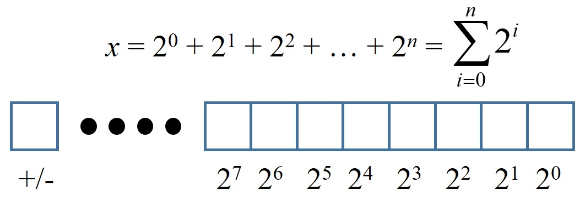

# 基本型別介紹
C 是較早就發展出來的語言，早期的記憶體容量沒有很大，故有內建許多型別供程式設計師，針對數值的類別及範圍選擇使用記憶體最小的使用，下列整理出 C 語言中的所有型別。

其中基本型別就是最小單位，組合類別與指標皆與基本型別有關。

| 型別 | 別名 | 範圍 | 大小(Byte) |
| --- | --- | ---: | ---: |
| 字元 int_8t | char | –2^7 ~ 2^7 – 1 | 1 |
| 短整數 int_16t | short int | –2^15 ~ 2^15 – 1 | 2 |
| 整數 int_32t | int | –2^31 ~ 2^31 – 1 | 4 |
| 長整數 int_64t | long int | –2^63 ~ 2^63 – 1 | 8 |

| 型別 | 精度 | 範圍 | 大小(Byte) |
| --- | --- | ---: | ---: |
| 單精度浮點數 float | 7 位數 | 約–10^–39 ~ 10^38 | 4 |
| 雙精度浮點數 double | 15 位數 | 約–10^–309 ~ 10^308 | 8 |

註：不同的標準與編譯器也許與上述不同，可使用 limit.h 確認
http://tw.gitbook.net/c_standard_library/limits_h.html

## 1. 整數
在電腦中皆是使用 0 與 1 (1 bit, 8 bits = 1 byte) 來表達，而數值上即為**二進位**，任意十進位的整數皆能使用二進位表示。在上述整數型別中，以 char 為例，其大小為 1 byte = 8 bits，最左邊的位元保留給符號使用，再往右依序為 2^7, 2^6, ..., 2^0，故其範圍為 –2^7 ~ 2^7 – 1。若最前面的位元不保留給符號使用，也就是無號數，則範圍為 0~ 2^8 – 1，在 C 語言中，**所有整數型別預設為有號數**，若要使用無號數則使用 **unsigned** 此關鍵字。

註：2^10 ~ 10^3，可使用此關係來估算。

## 2. 位移運算
位移運算僅能使用於整數型別的數值。由於電腦儲存數值的方式，可知該整數型別往右位移`>>`即為除二，最左邊自動補 0，反之`<<`為乘二，最右邊自動補 0。

範例： a*8 --> a<<3 (a連續乘 2 三次)，a*9 = a*(8+1) = a*8 + a --> a = a << 3 + a

## 3. 浮點數
