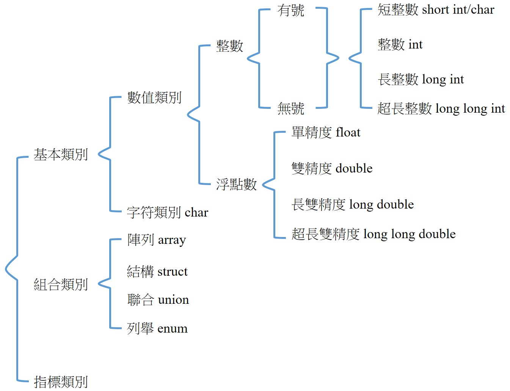

一、基本型別介紹
===
C 是較早就發展出來的語言，早期的記憶體容量沒有很大，故有內建許多型別供程式設計師，針對數值的類別及範圍選擇使用記憶體最小的使用，下列整理出 C 語言中的所有型別。

其中基本型別就是最小單位，組合類別與指標皆與基本型別有關。

| 型別 | 別名 | 範圍 | 大小(Byte) |
| --- | --- | --- | --- |
| 字元 int_8t | char | –2^7 ~ 2^7 – 1 | 1 |
| 短整數 int_16t | short int | –2^15 ~ 2^15 – 1 | 2 |
| 整數 int_32t | int | –2^31 ~ 2^31 – 1 | 4 |
| 長整數 int_64t | long int | –2^63 ~ 2^63 – 1 | 8 |

| 型別 | 精度 | 範圍 | 大小(Byte) |
| --- | --- | --- | --- |
| 單精度浮點數 float | 7 位數 | 約–10^–39 ~ 10^38  | 4 |
| 雙精度浮點數 double | 15 位數 | 約–10^–309 ~ 10^308  | 8 |

註：不同的標準與編譯器也許與上述不同，可使用 limit.h 確認
http://tw.gitbook.net/c_standard_library/limits_h.html
